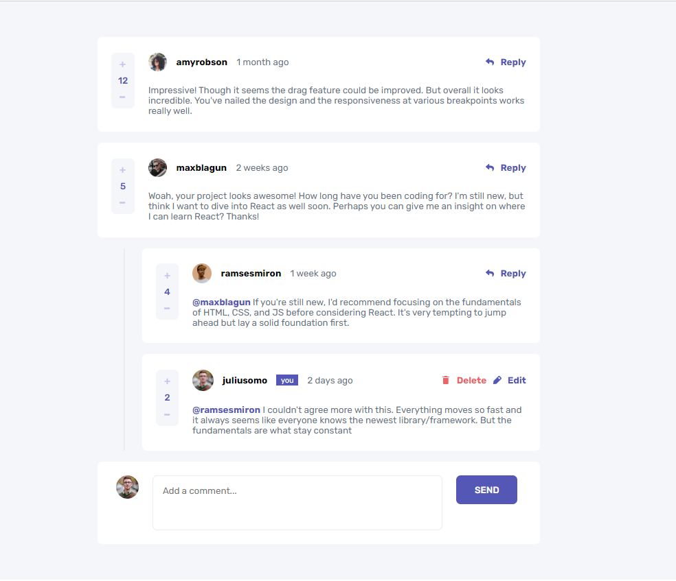

### The challenge

Users should be able to:

- View the optimal layout for the app depending on their device's screen size
- See hover states for all interactive elements on the page
- Create, Read, Update, and Delete comments and replies
- Upvote and downvote comments

### Links

- Solution URL: [Solution](https://www.frontendmentor.io/solutions/interactive-comment-section-crud-javascriptnodejs-bMExmc5cw4)
- Live Site URL: [LIVE](https://commentsectionapp.herokuapp.com/)

### Built with

- HTML5 
- SCSS 
- JAVASCRIPT
- NODE JS
- MONGOOSE

### Continued development

Updating info without page refreshing

## Author

- Frontend Mentor - [Abrosss](https://www.frontendmentor.io/profile/Abrosss)
- [Twitter](https://twitter.com/ronessu)

